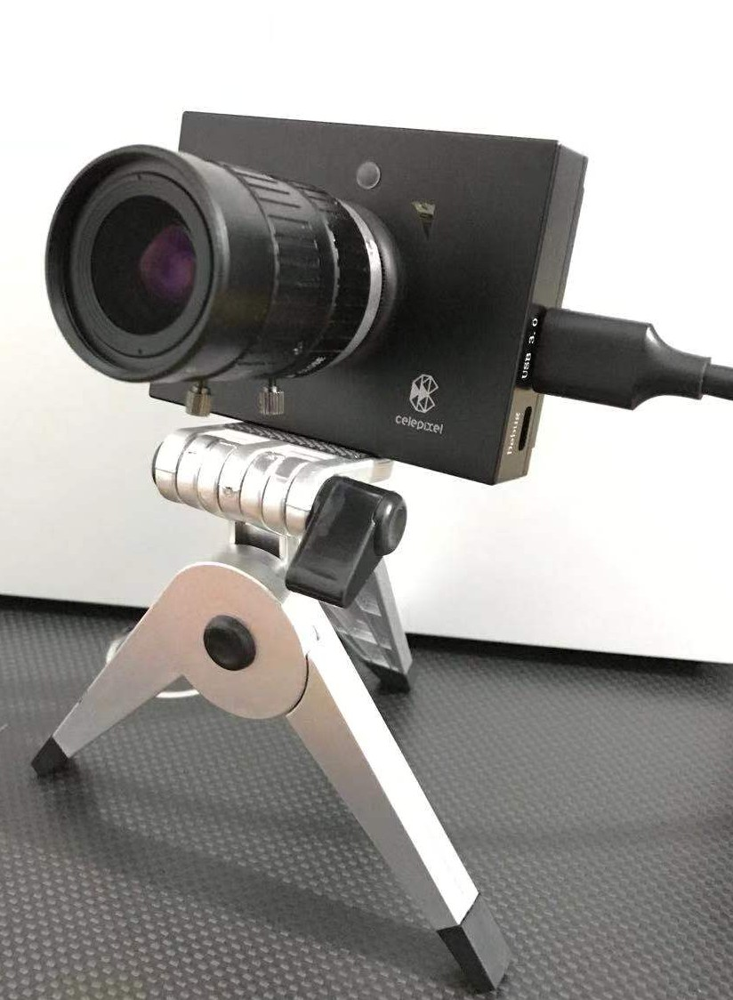

*[中文版本](README_zh.md)*

# CeleX5-ROS

> The ROS packages for CeleX™ CeleX5-MIPI Dynamic Vision Sensor.

This repository provides several functional packages and examples of CeleX5-MIPI Event-based Camera under ROS, including:

- [`celex5_ros`](celex5_ros): provides a more perfect driver under ROS of CeleX5-MIPI Event-based Camera.
- [`celex5_msgs`](celex5_msgs): ROS message types for CeleX5-MIPI.
- [`celex5_calibration`](celex5_calibration): provides tools and tutorials related to the calibration of CeleX5-MIPI, based on events data.

***The code in this repository mainly follows the [Google C++ Style](https://google.github.io/styleguide/cppguide.html).***

[Introduction](#introduction)

[Overview](#overview)

[Build and Run](#build-and-run)

[Known Issues](#known-issues)

[Q&A](#qa)

## Introduction



CeleX™ is a family of smart image sensor specially designed for machine vision. Each pixel in CeleX™ sensor can individually monitor the relative change in light intensity and report an event if it reaches a certain threshold. Asynchronous row and column arbitration circuits process the pixel requests and make sure only one request is granted at a time in fairly manner when they received multiple simultaneous requests. The output of the sensor is not a frame, but a stream of asynchronous digital events. The speed of the sensor is not limited by any traditional concept such as exposure time and frame rate. It can detect fast motion which is traditionally captured by expensive, high speed cameras running at thousands of frames per second, but with drastic reduced amount of data.

CeleX-5 is a multifunctional smart image sensor with **1Mega-pixels**(1280*800) and some additional features integrating on-chip (such as on-chip optical-flow). The sensor supports several different output formats: pure binary address-events, address-events with either pixel intensity information or timing information. In addition, the readout scheme of the sensor could either be asynchronous data stream or synchronous full frames. Different combinations of the output format and readout scheme lead to great flexibility of this sensor, which supports **6 separate operation modes** in total (but one of them doesn't provide corresponding interface in SDK). To further meet the requirements of different applications, the sensor could also be configured into a **loop-mode**, in which it could automatically switch among three separate modes.

[ROS](https://www.ros.org/) is a very popular experimental platform, which provides rich development interfaces and resources. But in the [official open source repository](https://github.com/CelePixel/CeleX5-MIPI) of CeleX ™, the examples under ROS are very incomplete:

1. The official SDK version has been updated to v2.0, however the version supported by its ROS-Sample remains at v1.6.
2. The official ROS-Sample is just a simple example. It only outputs an image in a working mode. It does not provide a comprehensive and convenient parameter configuration function and interface.

***Therefore, in order to make more convenient use of the resources provided by ROS, I developed the content in this repository.***

## Overview

This repository provides several functional packages and examples of CeleX5-MIPI Event-based Camera under ROS, including:

- [`celex5_ros`](celex5_ros): A more perfect driver under ROS of CeleX5-MIPI Event-based Camera. You can freely configure and output multiple channels of data (raw event data, IMU data, grayscale frames, optical flow information, etc.) according to your needs, and provide the `rqt_reconfigure` panel to support dynamic parameter configuration. [More details](celex5_ros)

  

  *Currently only tested on CeleX5-MIPI products. Other series of CeleX5 are not tested because I have no such equipments.*

- [`celex5_msgs`](celex5_msgs): ROS message types for CeleX5-MIPI.

- [`celex5_calibration`](celex5_calibration): provides tools and tutorials related to the calibration of CeleX5-MIPI, based on events data. Including calibration board generation (currently only support the blinking checkerboard, other types to be added), intrinsics calibration, extrinsics calibration with another traditional frame camera (using [Kalibr](https://github.com/ethz-asl/kalibr)), synchronous collection and publishing of image data required for calibration, time stamp alignment with traditional camera (*TODO*, existing problems) and other tools. [More details](celex5_calibration)

  

*It is recommended that you read the concept section of the [CeleX_SDK_Getting_Started_Guide](https://github.com/CelePixel/CeleX5-MIPI/blob/master/Documentation/CeleX_SDK_Getting_Started_Guide_EN.pdf) and [CeleX5_SDK_Reference](https://github.com/CelePixel/CeleX5-MIPI/blob/master/Documentation/CeleX5_SDK_Reference_EN.pdf) documentation provided by CeleX carefully before using it, and have a general understanding of basic terminology.*

## Build and Run

1. Build

   ```bash
   mkdir -p ~/celex_ws/src
   cd ~/celex_ws/src
   git clone git@github.com:kehanXue/CeleX5-ROS.git
   git submodule update --init --recursive
   # Or with http: `git clone https://github.com/kehanXue/CeleX5-ROS.git`
   cd ..
   rosdep install -y --from-paths src --ignore-src --rosdistro $ROS_DISTRO
   catkin_make # Or use `catkin build`
   ```

   If the building process reports the errors of which dependent libraries are missing, install them.

2. Create the udev rules to solve the permission denied problem when read/write from a usb device:

   ```shell
cd ~/celex_ws/src/CeleX5-ROS/celex5_ros/scripts
   chmod +x ./create_udev_rules.sh
   ./create_udev_rules.sh
   ```
   
3. Run `celex5_ros`. [More details](celex5_ros)

   First plug the sensor into your computer.

   ```bash
   source ~/celex_ws/devel/setup.bash # Or source setup.zsh when you use zsh
   roslaunch celex5_ros celex5_ros_node.launch
   # In a new Terminal
   rosrun rqt_reconfigure rqt_reconfigure # Open rqt_reconfigure to config
   ```

   If the program runs without error, you have run successfully. Use `rostopic list` to see published topics, and use` rivz` or `image_view` to subscribe to corresponding image topics to see published images. Whether to publish data to an image topic is determined by both the whether display parameter configuration and the sensor current working mode.

   ```bash
   $ rostopic list
   /celex5_mipi/display/accumulated_img/camera_info
   /celex5_mipi/display/accumulated_img/raw_image
   /celex5_mipi/display/binary_img/camera_info
   /celex5_mipi/display/binary_img/raw_image
   /celex5_mipi/display/count_img/camera_info
   /celex5_mipi/display/count_img/raw_image
   /celex5_mipi/display/denoised_binary_img/camera_info
   /celex5_mipi/display/denoised_binary_img/raw_image
   /celex5_mipi/display/full_frame_img/camera_info
   /celex5_mipi/display/full_frame_img/raw_image
   /celex5_mipi/display/gray_img/camera_info
   /celex5_mipi/display/gray_img/raw_image
   /celex5_mipi/display/in_pixel_img/camera_info
   /celex5_mipi/display/in_pixel_img/raw_image
   /celex5_mipi/display/optical_flow_direction_img/camera_info
   /celex5_mipi/display/optical_flow_direction_img/raw_image
   /celex5_mipi/display/optical_flow_img/camera_info
   /celex5_mipi/display/optical_flow_img/raw_image
   /celex5_mipi/display/optical_flow_speed_img/camera_info
   /celex5_mipi/display/optical_flow_speed_img/raw_image
   /celex5_mipi/display/parameter_descriptions
   /celex5_mipi/display/parameter_updates
   /celex5_mipi/display/superimposed_img/camera_info
   /celex5_mipi/display/superimposed_img/raw_image
   /celex5_mipi/events
   /celex5_mipi/imu_data
   /celex5_mipi/polarity_img/camera_info
   /celex5_mipi/polarity_img/raw_image
   /celex5_mipi/sensor/parameter_descriptions
   /celex5_mipi/sensor/parameter_updates
   /rosout
   /rosout_agg
   ```

   Topic of raw events data: `/celex5_mipi/events`

   Topic of imu data: `/celex5_mipi/imu_data` . *Note that the ROS message type of imu topic is different from the standard IMU message type (sensor_msgs/Imu) in ROS due to the way of obtaining the raw imu data of CeleX5.*

   View an image via `image_view`:

   ```bash
   rosrun image_view image_view image:=/celex5_mipi/display/binary_img/raw_image
   ```

4. Run `celex5_calibration`. [More details](celex5_calibration)

   A series of methods and tools for camera parameter calibration based on events data are provided.

   - Pattern generator (blinking chessboard). [More details](celex5_calibration/src/pattern)

     Run:

     ```bash
     rosrun celex5_ros pattern_generator_node
     # In a new Terminal
     rosrun rqt_reconfigure rqt_reconfigure #  Open rqt_reconfigure to config
     ```

   - Intrinsics calibration based on [camera_calibration](http://wiki.ros.org/camera_calibration/Tutorials) toolkit in ROS. (if you want to calibrate the external parameters of other cameras, this tool in ROS only supports the same resolution...) 

     Install:

     ```bash
     sudo apt install ros-$ROS_DISTRO-camera-calibration
     ```

     The detailed tutorials: [link](celex5_calibration/src/intrinsics_extrinsics/pkg_camera_calibration)

   - Based on [Kalibr](https://github.com/ethz-asl/kalibr) toolkit, which supports both intrinsics calibration and extrinsics calibration with another (traditional or event-based) cameras, in different resolutions. Event data based method. 

     The detailed tutorials: [link](celex5_calibration/src/intrinsics_extrinsics/kalibr)

     Also provides a series of tools to collect calibration data of CeleX5-MIPI Camera.

   - Time stamp calibration with another camera.

     *TODO*, existing problems. [link](celex5_calibration/src/temporal)

## Known Issues

**celex5_ros**

- The implementation of the [Nodelet](http://wiki.ros.org/nodelet) interface still has problems (the ros node version has no problem). During the process of loading the camera's parameter file through the nodelet, **parsed xml files will be garbled**. I haven't found the problem for a long time. If you provide suggestions, I will be very grateful.
- Regarding the `Multi_Read_Optical_Flow_Mode` mode in the document, no relevant interface was found in the SDK. 
- The function of generating FPN has not been added yet, please still use the official GUI Demo provided by CeleX™ to generate FPN (The GUI Demo running under Linux may report `Segmentation fault (core dumped)` errors directly. It is more stable under Windows).
- The function of recording bin files use CeleX™ SDK is not provided for now, but under ROS we can use ROS bag for recording.

**celex5_calibration**

- The time stamp calibration with another camera.

## Q&A

- Why the sensor is connected and the program run looks well, but I can't get the data from the sensor?

  Please check the permission of the usb device. In [Build and Run](#build-and-run) section 2, you can create the udev rules for CeleX sensor to solve the permission problem.

  You can export a Linux environment variable to get the debug information of `libusb`:

  ```shell
  export LIBUSB_DEBUG=1
  ```

  then in the same terminal, launch the celex_ros:

  ```shell
  roslaunch celex5_ros celex5_ros_node.launch
  ```

  you may see some error from `libusb` output. Such as:

  ```
  libusb: error [_get_usbfs_fd] libusb couldn't open USB device /dev/bus/usb/****: Permission denied
  libusb: error [_get_usbfs_fd] libusb requires write access to USB device nodes.
  ```

  The you can use the scripts in `celex_ros/scripts` to create the udev rules to solve the permission problem.

